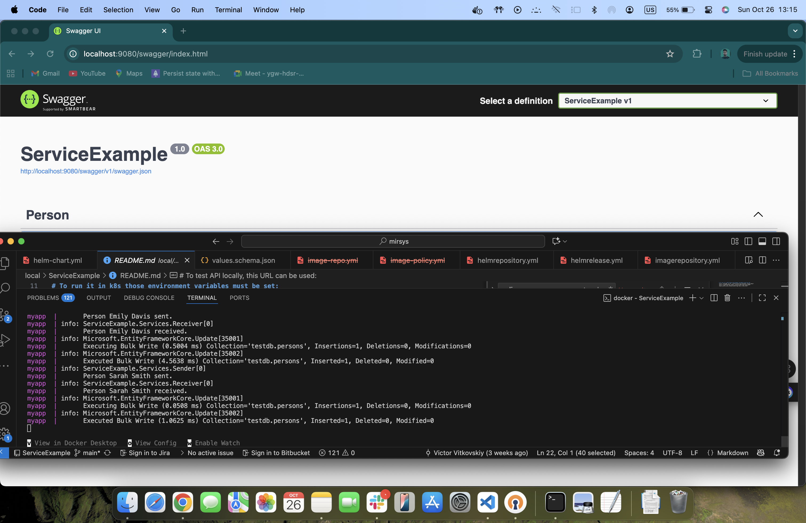

# TASK 1 Application Setup
You will be provided with a simple .NET application source code (Link) that uses MongoDB for persistent storage, NATS for event streaming and Redis for caching.
Your first task is to get the application running locally.

# TASK1 Implemenation/ Solution:

### Accessing locally URL : http://localhost:9080/swagger/index.html

