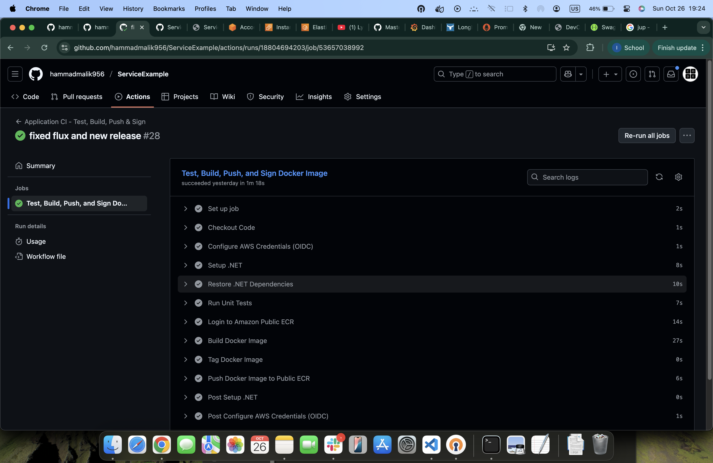
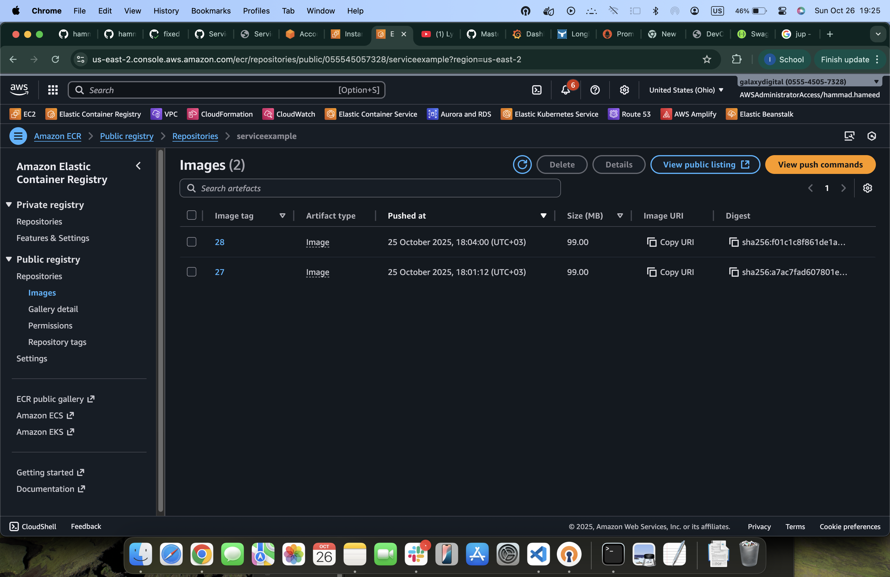
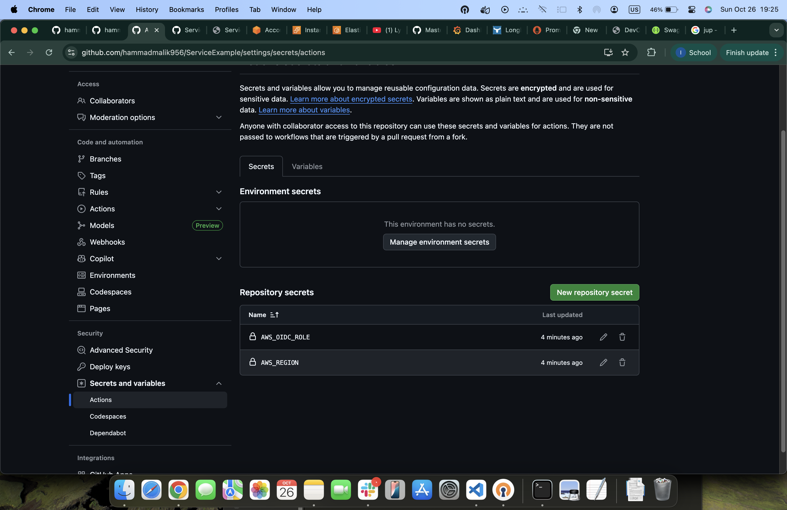

# TASK 2  Repository & CI

Create a public Git repository (preferably on Azure DevOps, GitHub, or GitLab is acceptable).

Configure the CI to run the automated tests, then build and push the Docker image to a container registry (Azure Container Registry, DockerHub, or another public registry).

Any environment variables and secrets need to be stored securely.

## Using Github Public Repository 

## Build and Push the Image to AWS ECR(AWS Container Registry)

##
##

## environment variables and secrets need to be stored securely

