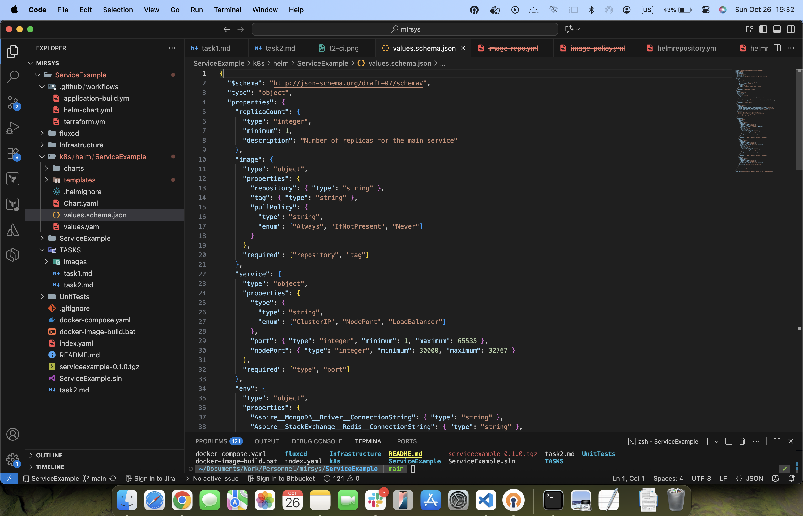

# TASK 3 Helm Chart
Package the application as a Helm chart for easy K8S deployment.

Publish the Helm chart to ArtifactHub (or any public Helm repository).

Optional: Include a values.schema.json file for validation.

## Package the application as a Helm chart for easy K8S deployment.

##
##

## Publish the Helm chart to ArtifactHub.

## Include a values.schema.json file for validation.

