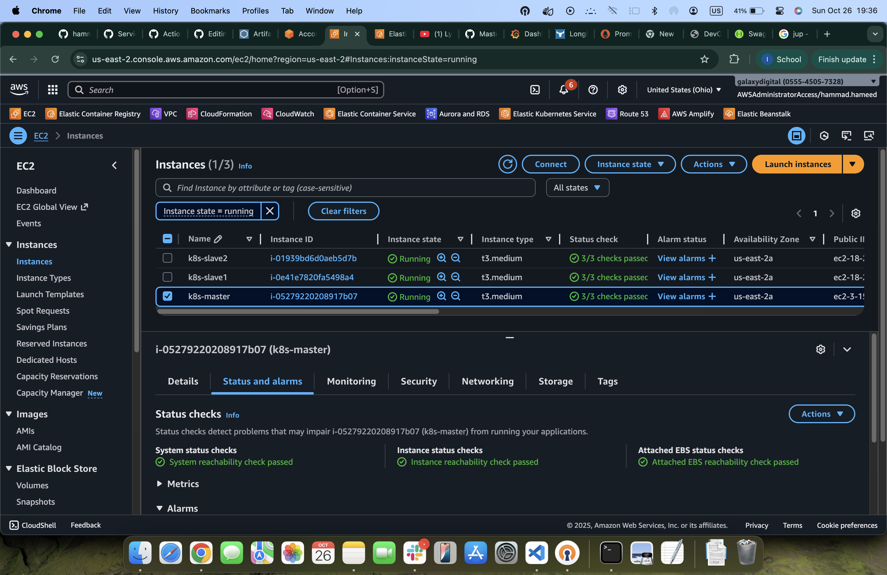
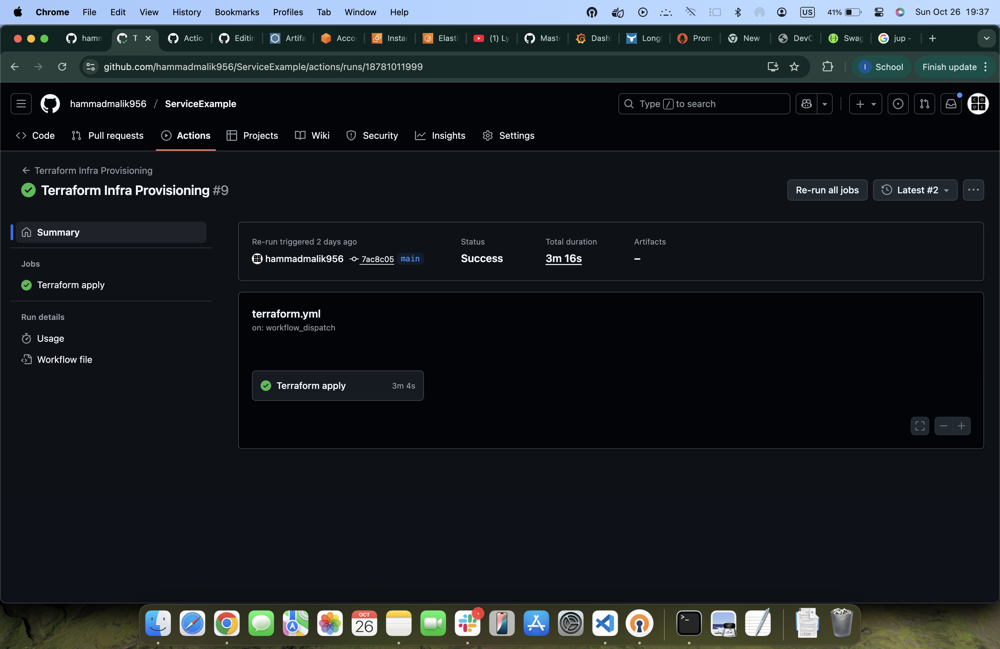
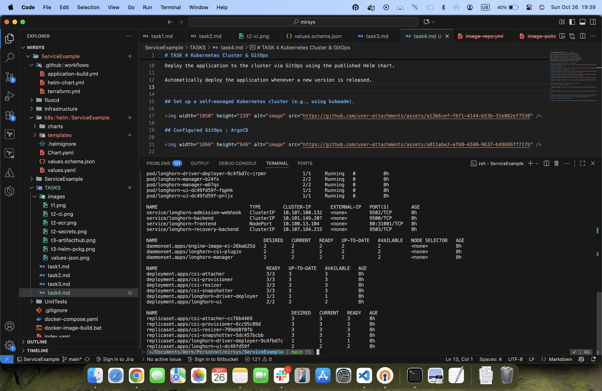
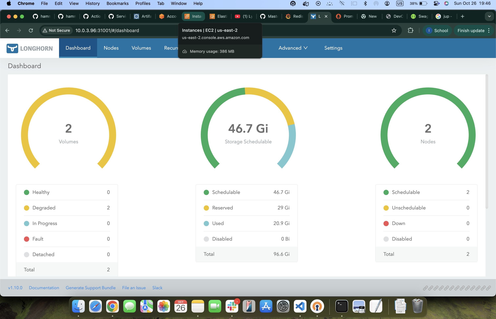
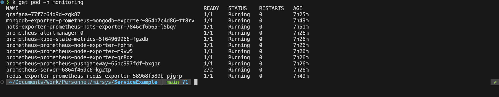
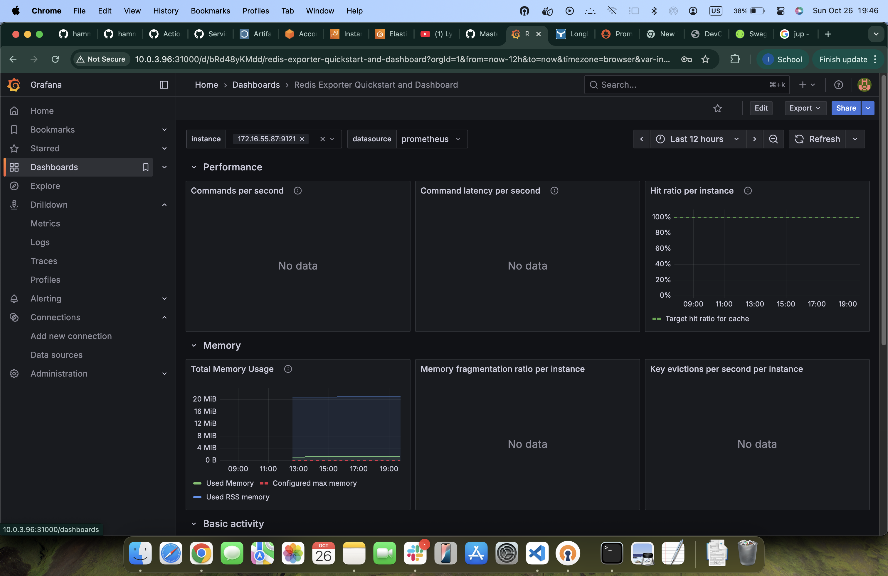
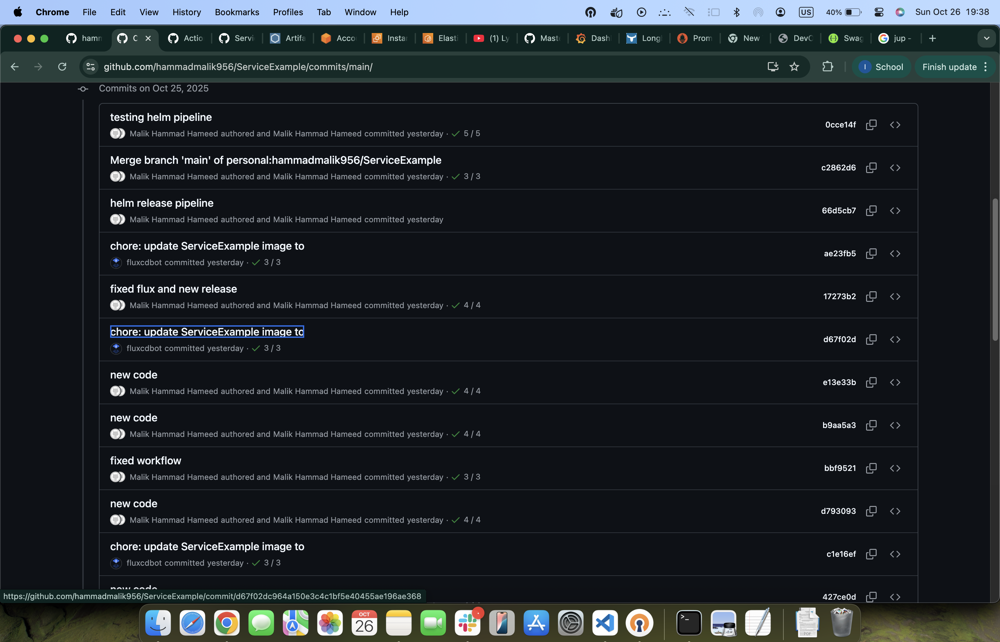
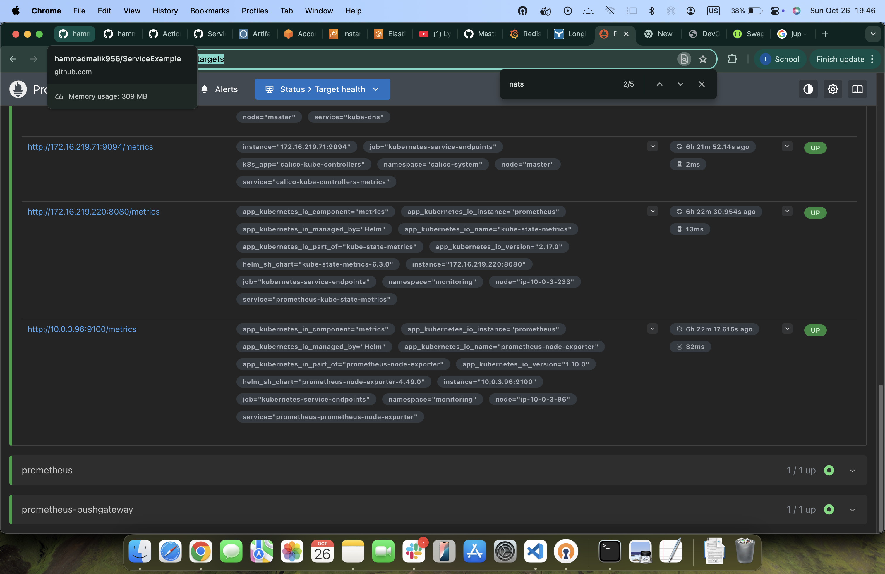
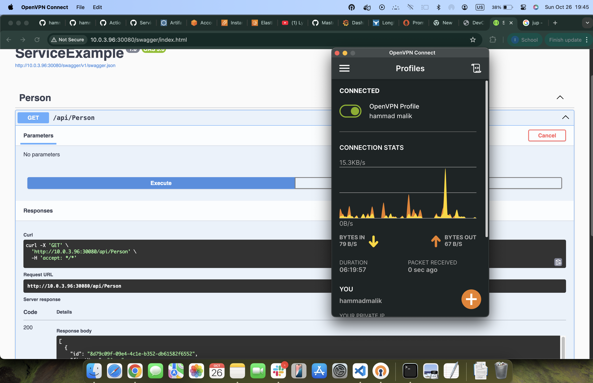

# TASK 4 Kubernetes Cluster & GitOps
Set up a self-managed Kubernetes cluster (e.g., using kubeadm).

Configure GitOps (e.g., preferably FluxCD, ArgoCD or similar is also OK).

Deploy a storage solution of your choice (e.g., Longhorn or Ceph Rook).

Deploy an observability stack of your choice (e.g., Prometheus, Loki, Grafana)

Deploy the application to the cluster via GitOps using the published Helm chart.

Automatically deploy the application whenever a new version is released.

## Set up a self-managed Kubernetes cluster (e.g., using kubeadm).

## Github Actions Pipeline to deploy k8s on AWS

## 

## Deploy a storage solution of your choice (e.g., Longhorn ).

##

##

## Deploy an observability stack of your choice (e.g., Prometheus, Loki, Grafana)

##
##

##

##
##

## Prometheus

## Accessing the Application from K8s using URL: http://${nodeIp}:${nodeport}/swagger/index.html

## Application is secured in private subnets and VPN must be connected to access the application

